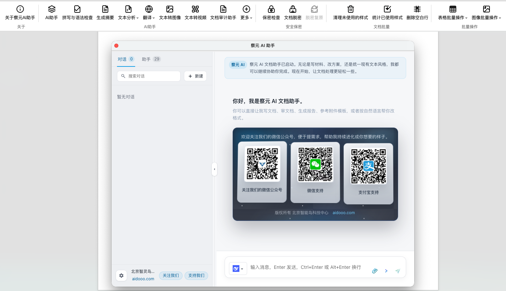
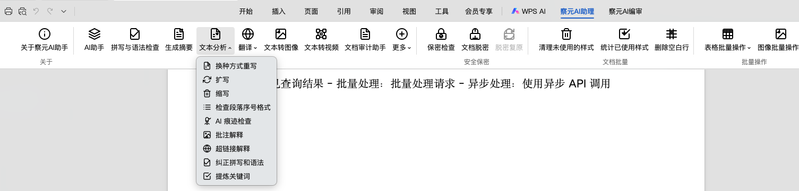

# Chayuan AI Document Assistant — Manuel complet

**[简体中文](README.md#简体中文完整说明)** · **[English](README.en.md)** · **[日本語](README.ja.md)** · **[Русский](README.ru.md)** · **[Deutsch](README.de.md)** · **[Español](README.es.md)** · **[README.md](README.md)**

---

## Nouveautés v3.0 — Intégration RAG d’une base de connaissances distante

Consommation directe de bases de connaissances entreprise / équipe / personnelles dans l’éditeur WPS : la question déclenche la recherche automatique, l’assemblage du contexte et une réponse avec citations, plus le téléchargement en un clic de la pièce jointe d’origine.

- **Double mode d’authentification** (JWT utilisateur / HMAC application), identifiants chiffrés en AES-GCM
- **Pipeline de récupération multi-sources** (`services/kb`) : réécriture → recherche par lots → déduplication → re-ranking → prompt avec citations
- **Bandeau de citations avec téléchargement de l’original**, les sources document / structurée / vectorielle / office sont différenciées
- **Auto-rétablissement des liaisons obsolètes** : la suppression d’une KB ou la révocation des droits vide le cache silencieusement — fini les toasts rouges "search_batch HTTP 403"
- **Rollback en un flag** : `kbRemoteIntegration` désactive tout le pipeline RAG d’un coup

Notes de version complètes : [RELEASE_NOTES_v3.0.md](RELEASE_NOTES_v3.0.md)

---

## 1. Droits d’auteur et licence

**Nom du logiciel :** Chayuan AI Document Assistant (nom produit chinois **察元 AI 文档助手**, paquet npm **`chayuan`**). Code sous **[Apache License 2.0](LICENSE)**. Utilisation commerciale autorisée si la licence est respectée. Les accords séparés priment lorsqu’ils s’appliquent.

**Titulaire :** Beijing Zhilingniao Technology Center. **Site :** [https://aidooo.com](https://aidooo.com).

---

## 2. Règle spéciale : ne pas modifier la marque «察元» dans l’interface

Sans autorisation écrite, ne remplacez pas et ne masquez pas les libellés fixes **察元**, **察元 AI**, **察元 AI 文档助手**, etc., dans les **boîtes de dialogue, ruban Ribbon, menus contextuels, volets de tâches ni page À propos** (y compris **关于察元**, **添加到察元 AI 助手**, types de fichiers **察元模板** / **察元规则** / **察元文档**). Les builds redistribués avec l’UI officielle doivent conserver ces mentions ou suivre un accord distinct.

---

## 3. Utilisation commerciale

Autorisée sous Apache 2.0 et la section 2 ; exceptions par contrat.

---

## 4. Aperçu

Complément **WPS Writer** (**Vue 3 + Vite**) : dialogue IA, résumé, analyse, traduction, multimodal, sécurité/déclassification, traitement par lots document/tableaux/images, formulaires, modèles/règles, file d’orchestration — écriture **insérer / remplacer / commentaire / commentaire lié / ajouter en fin**. **Priorité hors-ligne / intranet** via **Ollama** et API **compatibles OpenAI**.

---

## 4.1 Version 2.0.0 : refonte majeure et stabilité

**Version actuelle : `2.0.0`.** Cette version consolide les documents Markdown de planification et d’exécution : plan v2, P0-P6, workflow W1-W7, refonte du système de tâches, corrections de stabilité et mise en page des assistants.

- Les assistants nécessitant des paramètres affichent un formulaire avant exécution : langue cible pour la traduction, ratio/durée/style vocal pour image, vidéo et audio.
- La sélection de modèles est filtrée par type : le dialogue de chat ne montre que les modèles conversationnels ; les paramètres regroupent les modèles par catégorie.
- Le déploiement hors-ligne / intranet reste prioritaire via Ollama, LM Studio, Xinference, OneAPI, New API et passerelles compatibles OpenAI.
- La stabilité des tâches, des reprises, de la propagation des paramètres et de l’écriture dans le document est renforcée.

La comparaison concurrentielle complète avec **60 dimensions** est dans le README principal : [README.md § 4.2](README.md#42-60-项竞品能力对比察元-200-vs-常见办公-ai--文档-ai-工具).

---

## 5. Captures d’écran

| Assistant et chat | Tâches et relecture | Paramètres et modèles |
|:---:|:---:|:---:|
|  |  |  |

Autres écrans 

---

## 6–7. Fonctions et assistants

Liste détaillée : **[README.en.md](README.en.md)** ou manuel long **[README.md](README.md#简体中文完整说明)**. Les **assistants personnalisés** couvrent rapports, annotations et pipelines de modification.

---

## 8–9. Modèles et build

`npm install` · `npm run dev` · `npm run build` · `npm run build:wps` · débogage **`wpsjs debug`**.

---

## 10. Dons

[aidooo.com](https://aidooo.com) ; respecter les [conditions GitHub](https://docs.github.com/en/site-policy/github-terms/github-terms-of-service).

---

Chayuan · Vue 3 + Vite · Apache-2.0 · **ne modifiez pas la marque «察元» dans les dialogues et menus sans autorisation** · **usage commercial autorisé** sauf exception contractuelle

